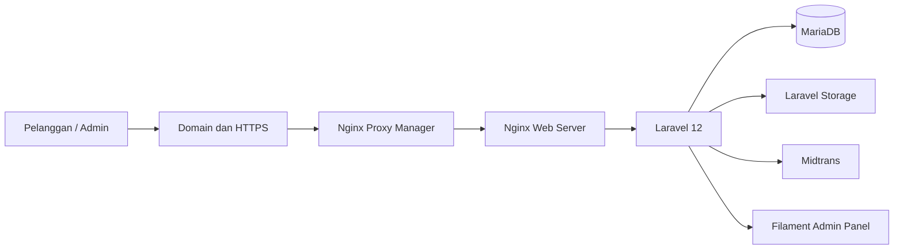

# Tukang Print Dadakan


**Tukang Print Dadakan** adalah sistem pemesanan dan pengelolaan layanan cetak mahasiswa berbasis web. Sistem ini dikembangkan untuk memusatkan proses pemesanan, pengunggahan file, perhitungan biaya, pembayaran, pemantauan status, serta pengelolaan operasional usaha dalam satu aplikasi.

Website dikembangkan menggunakan Laravel 12, Blade, Tailwind CSS, JavaScript, MariaDB, Filament, Docker, Nginx, dan Midtrans.

## Informasi Proyek

| Informasi | Keterangan |
|---|---|
| Nama proyek | Tukang Print Dadakan |
| Jenis proyek | Capstone Project Pemrograman Web |
| Pengembang | Ilham Firmansyah |
| NIM | 20240801102 |
| Program studi | Teknik Informatika |
| Fakultas | Fakultas Ilmu Komputer |
| Universitas | Universitas Esa Unggul |
| Tahun akademik | Genap 2025–2026 |
| Framework | Laravel 12 |
| Status | Aktif dan telah di-deploy |
| Repository | [github.com/ilhammf/tukangprintdadakan-2026](https://github.com/ilhammf/tukangprintdadakan-2026) |
| Website production | [print.ilhamfirmansyah.store](https://print.ilhamfirmansyah.store) |

---

## Latar Belakang

Sebelum sistem dikembangkan, proses pemesanan layanan cetak dilakukan melalui WhatsApp. Pelanggan mengirimkan file, menjelaskan kebutuhan cetak, menanyakan harga, mengonfirmasi pembayaran, dan memantau proses pengerjaan melalui percakapan langsung.

Proses tersebut menimbulkan beberapa kendala:

- Data pesanan dan file pelanggan tersebar dalam banyak percakapan.
- Admin kesulitan mencari kembali pesanan lama.
- Perhitungan biaya masih dilakukan secara manual.
- Pelanggan harus menghubungi admin untuk mengetahui status pesanan.
- Konfirmasi pembayaran belum terintegrasi.
- Antrean pengerjaan belum tercatat secara terpusat.
- Pemilik usaha kesulitan memantau transaksi dan pendapatan.

Tukang Print Dadakan dikembangkan untuk mengubah proses tersebut menjadi layanan digital yang lebih terstruktur, terpusat, dan mudah digunakan.

---

## Fitur Utama

### Website publik

- Halaman beranda.
- Informasi tentang usaha.
- Daftar kategori dan layanan cetak.
- Detail layanan dan harga dasar.
- Informasi kontak dan jam operasional.
- Formulir pesan pelanggan.
- Halaman login dan registrasi.

### Pelanggan

- Registrasi akun.
- Login dan logout.
- Pengelolaan profil.
- Perubahan kata sandi.
- Pemilihan layanan cetak.
- Pembuatan pesanan.
- Upload file pesanan.
- Pemilihan jenis cetak dan ukuran kertas.
- Pengaturan jumlah halaman dan jumlah salinan.
- Pilihan jilid dan laminating.
- Perhitungan estimasi biaya.
- Penentuan jadwal dan lokasi pengambilan.
- Pembayaran melalui Midtrans.
- Monitoring status pembayaran.
- Monitoring status pengerjaan.
- Riwayat dan detail pesanan.
- Pembatalan pesanan sesuai ketentuan.

### Admin atau pemilik usaha

- Dashboard monitoring.
- Pengelolaan pelanggan.
- Pengelolaan kategori layanan.
- Pengelolaan layanan dan harga.
- Pemeriksaan pesanan pelanggan.
- Pemeriksaan dan pengunduhan file.
- Verifikasi pesanan.
- Pengelolaan antrean pengerjaan.
- Pembaruan status pesanan.
- Pengelolaan pembayaran.
- Pengelolaan pengiriman atau pengambilan.
- Pengelolaan pesan masuk.
- Pengelolaan informasi website.
- Pengelolaan aturan booking.
- Pengelolaan hari libur.
- Pengelolaan role dan permission.
- Activity log.
- Laporan transaksi dan pendapatan.

---

## Status Pesanan

Sistem menggunakan status pengerjaan berikut:

1. **Menunggu Verifikasi**
2. **Diproses**
3. **Siap Diambil**
4. **Selesai**
5. **Dibatalkan**

Alur utama status pesanan:

```text
Menunggu Verifikasi
├── Diproses
│   └── Siap Diambil
│       └── Selesai
└── Dibatalkan
```

Pesanan hanya dapat dibatalkan oleh pelanggan selama masih berstatus **Menunggu Verifikasi**.

---

## Status Pembayaran

Status transaksi dari Midtrans dipetakan menjadi status internal berikut:

| Status aplikasi | Keterangan |
|---|---|
| Belum Bayar | Transaksi belum dilakukan |
| Menunggu Verifikasi | Transaksi masih menunggu hasil pembayaran |
| Lunas | Pembayaran berhasil diterima |
| Ditolak | Pembayaran ditolak, dibatalkan, kedaluwarsa, atau gagal |

Status Midtrans seperti `pending`, `settlement`, `capture`, `deny`, `cancel`, `expire`, dan `failure` diproses dan dipetakan ke status pembayaran aplikasi.

---

## Teknologi

| Komponen | Teknologi |
|---|---|
| Backend | Laravel 12 |
| Bahasa backend | PHP |
| Frontend | Blade, HTML, CSS, JavaScript |
| Styling | Tailwind CSS |
| Admin panel | Filament |
| Database | MariaDB |
| Payment gateway | Midtrans Snap dan Midtrans API |
| Penyimpanan file | Laravel Storage |
| Web server | Nginx |
| Reverse proxy | Nginx Proxy Manager |
| Containerization | Docker dan Docker Compose |
| Server | VPS Ubuntu |
| Version control | Git dan GitHub |
| Development environment | WSL Ubuntu dan Visual Studio Code |
| Keamanan komunikasi | HTTPS |

---

## Arsitektur Sistem



Alur akses utama:

```text
Pengguna
   ↓
Domain dan HTTPS
   ↓
Nginx Proxy Manager
   ↓
Nginx
   ↓
Laravel
   ├── MariaDB
   ├── Laravel Storage
   ├── Filament
   └── Midtrans
```

---

## Struktur Repository

```text
tukangprintdadakan-2026/
├── db/
│   └── conf.d/
├── docs/
├── nginx/
├── php/
├── src/
│   ├── app/
│   │   ├── Console/
│   │   ├── Filament/
│   │   │   └── Admin/
│   │   │       ├── Pages/
│   │   │       ├── Resources/
│   │   │       └── Widgets/
│   │   ├── Http/
│   │   │   └── Controllers/
│   │   ├── Models/
│   │   ├── Policies/
│   │   ├── Providers/
│   │   └── Services/
│   │       └── MidtransService.php
│   ├── bootstrap/
│   ├── config/
│   ├── database/
│   │   ├── factories/
│   │   ├── migrations/
│   │   └── seeders/
│   ├── public/
│   ├── resources/
│   │   ├── css/
│   │   ├── js/
│   │   └── views/
│   │       ├── auth/
│   │       ├── customer/
│   │       ├── filament/
│   │       ├── layouts/
│   │       └── public/
│   ├── routes/
│   ├── storage/
│   └── tests/
├── .gitignore
├── docker-compose.yml
├── models.json
└── README.md
```

### Keterangan folder

| Folder | Fungsi |
|---|---|
| `db/conf.d` | Menyimpan konfigurasi MariaDB |
| `docs` | Menyimpan dokumen BRD, PRD, dan dokumentasi pendukung |
| `nginx` | Menyimpan konfigurasi Nginx |
| `php` | Menyimpan Dockerfile dan konfigurasi container PHP |
| `src` | Menyimpan source code utama Laravel |
| `src/app/Filament` | Menyimpan resource dan halaman admin |
| `src/app/Http/Controllers` | Menangani request dan logika controller |
| `src/app/Models` | Menyimpan model basis data |
| `src/app/Services` | Menyimpan service aplikasi, termasuk Midtrans |
| `src/database/migrations` | Menyimpan struktur tabel basis data |
| `src/resources/views` | Menyimpan antarmuka Blade |
| `src/routes` | Menyimpan routing aplikasi |
| `src/storage` | Menyimpan log dan file aplikasi |
| `docker-compose.yml` | Mengatur container aplikasi |
| `models.json` | Dokumentasi struktur model aplikasi |

---

## Persyaratan Sistem

Pastikan perangkat telah memiliki:

- Git.
- Docker Engine atau Docker Desktop.
- Docker Compose Plugin.
- Browser modern.
- Minimal RAM 4 GB.
- Port yang digunakan pada `docker-compose.yml` tersedia.
- Koneksi internet untuk mengunduh image dan dependency.

Untuk pengembangan melalui Windows, direkomendasikan menggunakan:

- Windows Subsystem for Linux 2.
- Ubuntu pada WSL.
- Visual Studio Code.
- Docker Desktop dengan integrasi WSL.

---

## Instalasi Menggunakan Docker

### 1. Clone repository

```bash
git clone https://github.com/ilhammf/tukangprintdadakan-2026.git
cd tukangprintdadakan-2026
```

### 2. Siapkan environment Docker

Buat file `.env` pada root repository apabila konfigurasi `docker-compose.yml` menggunakan environment variable:

```bash
cp .env.example .env
```

Apabila `.env.example` belum tersedia pada root project, buat file `.env` secara manual:

```env
PROJECT_NAME=tukangprintdadakan

MIDTRANS_SERVER_KEY=
MIDTRANS_CLIENT_KEY=
MIDTRANS_IS_PRODUCTION=false
MIDTRANS_IS_SANITIZED=true
MIDTRANS_IS_3DS=true
MIDTRANS_LOCAL_SANDBOX_FALLBACK=true

XDEBUG=false
PHP_IDE_CONFIG=
REMOTE_HOST=host.docker.internal
```

Jangan memasukkan credential production ke repository.

### 3. Build dan jalankan container

```bash
docker compose up -d --build
```

### 4. Periksa container

```bash
docker compose ps
```

atau:

```bash
docker ps
```

### 5. Lihat log aplikasi

```bash
docker compose logs -f
```

Untuk melihat log layanan tertentu:

```bash
docker compose logs -f NAMA_SERVICE
```

Nama service dapat dilihat pada file `docker-compose.yml`.

### 6. Hentikan container

```bash
docker compose down
```

Untuk menghapus container beserta volume:

> **Peringatan:** perintah berikut dapat menghapus data basis data yang tersimpan pada volume Docker.

```bash
docker compose down -v
```

---

## Proses Otomatis Docker Entrypoint

Container Laravel menggunakan `docker-entrypoint.sh` untuk menjalankan proses inisialisasi aplikasi.

Saat container dimulai, script menjalankan proses berikut:

1. Memeriksa apakah project Laravel telah tersedia.
2. Membuat project dari `raugadh/fila-starter:2.0` apabila folder aplikasi masih kosong.
3. Membuat atau memperbarui file `.env`.
4. Menunggu koneksi MariaDB tersedia.
5. Menginstal dependency Composer apabila folder `vendor` belum tersedia.
6. Mengatur application key.
7. Membuat folder `storage` dan `bootstrap/cache`.
8. Mengatur permission folder Laravel.
9. Menjalankan migration basis data.
10. Membuat symbolic link Laravel Storage.
11. Menjalankan cron service.
12. Membaca konfigurasi development dari `.env`.
13. Mengaktifkan atau menonaktifkan Xdebug.
14. Menjalankan perintah utama container.

Contoh output proses:

```text
🚀 Starting Laravel container setup...
✅ Laravel project already exists. Skipping create-project.
⏳ Waiting for database...
✅ Database is ready!
📦 Installing composer dependencies...
🔧 Fixing permissions...
🗃️ Running migrations...
🔗 Creating storage link...
🕒 Starting cron service...
✅ Laravel container setup complete. Ready to serve!
```

---

## Konfigurasi Aplikasi Laravel

File `.env` aplikasi Laravel berada di dalam folder aplikasi yang dipasang ke:

```text
/var/www/html/.env
```

Konfigurasi utama:

```env
APP_NAME="Tukang Print Dadakan"
APP_ENV=local
APP_DEBUG=true
APP_TIMEZONE=Asia/Jakarta
APP_URL=https://tukangprintdadakan.test

DB_CONNECTION=mariadb
DB_HOST=db
DB_PORT=3306
DB_DATABASE=tukangprintdadakan
DB_USERNAME=root
DB_PASSWORD=GANTI_DENGAN_PASSWORD_AMAN

SESSION_DRIVER=database
QUEUE_CONNECTION=database
CACHE_STORE=database

FILESYSTEM_DISK=local
```

Untuk production:

```env
APP_ENV=production
APP_DEBUG=false
APP_URL=https://print.ilhamfirmansyah.store
ASSET_URL=https://print.ilhamfirmansyah.store
LOG_LEVEL=warning
```

---

## Konfigurasi Midtrans

Daftarkan akun melalui dashboard Midtrans dan gunakan credential Sandbox selama proses pengembangan.

Tambahkan konfigurasi berikut melalui environment:

```env
MIDTRANS_SERVER_KEY=SB-Mid-server-xxxxxxxx
MIDTRANS_CLIENT_KEY=SB-Mid-client-xxxxxxxx
MIDTRANS_IS_PRODUCTION=false
MIDTRANS_IS_SANITIZED=true
MIDTRANS_IS_3DS=true
MIDTRANS_LOCAL_SANDBOX_FALLBACK=true
```

Untuk production:

```env
MIDTRANS_SERVER_KEY=Mid-server-xxxxxxxx
MIDTRANS_CLIENT_KEY=Mid-client-xxxxxxxx
MIDTRANS_IS_PRODUCTION=true
MIDTRANS_IS_SANITIZED=true
MIDTRANS_IS_3DS=true
MIDTRANS_LOCAL_SANDBOX_FALLBACK=false
```

### Webhook Midtrans

URL webhook harus mengarah ke route notifikasi pembayaran yang telah dikonfigurasi pada aplikasi Laravel.

Contoh pola URL:

```text
https://domain-aplikasi/route-webhook-midtrans
```

Pastikan:

- Endpoint dapat diakses dari internet.
- Server menggunakan HTTPS.
- Signature Midtrans diverifikasi.
- Nomor pesanan diperiksa.
- Jumlah pembayaran diperiksa.
- Notifikasi diproses secara idempoten.
- Pembayaran yang telah lunas tidak kembali menjadi belum bayar.

---

## Konfigurasi Storage

File pesanan dan gambar aplikasi disimpan menggunakan Laravel Storage.

Symbolic link dibuat secara otomatis oleh entrypoint:

```bash
php artisan storage:link
```

Folder yang harus dapat ditulis:

```text
storage/
bootstrap/cache/
```

Permission yang digunakan container:

```bash
chmod -R 775 storage bootstrap/cache
chown -R www-data:www-data storage bootstrap/cache
```

---

## Basis Data

Basis data utama menggunakan MariaDB.

Data utama yang dikelola meliputi:

- Pengguna.
- Role dan permission.
- Kategori layanan.
- Layanan.
- Pesanan.
- Detail pesanan.
- Pembayaran.
- Pengiriman atau pengambilan.
- Riwayat status pesanan.
- Pesan masuk.
- Pengaturan website.
- Pengaturan booking.
- Hari libur.
- Activity log.

Migration dijalankan secara otomatis ketika container dimulai:

```bash
php artisan migrate --force
```

---

## Format Upload File

Format yang didukung:

- PDF: `.pdf`
- Microsoft Word: `.doc`, `.docx`
- Microsoft PowerPoint: `.ppt`, `.pptx`
- Gambar: `.jpg`, `.jpeg`, `.png`

Batasan upload:

| Ketentuan | Batas |
|---|---:|
| Jumlah file per pesanan | Maksimal 5 file |
| Ukuran setiap file | Maksimal 20 MB |
| Total ukuran file | Maksimal 50 MB |

---

## Perhitungan Estimasi Biaya

Perhitungan dasar:

```text
Subtotal cetak =
harga layanan × jumlah halaman × jumlah salinan
```

Total pesanan:

```text
Total pesanan =
subtotal cetak
+ biaya jilid
+ biaya laminating
+ biaya prioritas
+ biaya pengiriman
+ biaya tambahan lainnya
```

Estimasi biaya dapat diperbarui setelah admin melakukan verifikasi terhadap file dan spesifikasi pesanan.

---

## Menjalankan Artisan Command

Nama service aplikasi dapat dilihat pada `docker-compose.yml`.

Contoh apabila service Laravel bernama `app`:

```bash
docker compose exec app php artisan migrate
docker compose exec app php artisan optimize:clear
docker compose exec app php artisan storage:link
docker compose exec app php artisan queue:work
docker compose exec app php artisan test
```

Apabila nama service berbeda, ganti `app` sesuai nama service pada `docker-compose.yml`.

---

## Build Asset Frontend

Apabila asset perlu dibangun ulang dari dalam container:

```bash
npm install
npm run build
```

Untuk mode development:

```bash
npm run dev
```

Jika Node.js dijalankan melalui service Docker terpisah, sesuaikan perintah dengan nama service pada `docker-compose.yml`.

---

## Pengujian

### Pengujian Laravel

```bash
php artisan test
```

### Pengujian fungsional

Pengujian black-box mencakup:

- Registrasi.
- Login.
- Validasi input.
- Daftar dan detail layanan.
- Pembuatan pesanan.
- Upload file.
- Estimasi biaya.
- Pembayaran Midtrans.
- Monitoring status.
- Pembatalan pesanan.
- Pengelolaan layanan.
- Verifikasi file.
- Perubahan status.
- Hak akses pelanggan dan admin.
- Laporan transaksi.

### User Acceptance Testing

UAT dilakukan terhadap pelanggan dan admin untuk menilai:

- Kemudahan tampilan.
- Kemudahan navigasi.
- Kejelasan informasi layanan.
- Kemudahan pemesanan.
- Kemudahan upload file.
- Kejelasan estimasi biaya.
- Kemudahan pembayaran.
- Kemudahan monitoring status.
- Pengurangan ketergantungan pada WhatsApp.
- Kelayakan sistem dalam kegiatan operasional.

---

## Perintah Operasional

### Menjalankan aplikasi

```bash
docker compose up -d
```

### Build ulang aplikasi

```bash
docker compose up -d --build
```

### Memeriksa status

```bash
docker compose ps
```

### Melihat seluruh log

```bash
docker compose logs -f
```

### Restart seluruh layanan

```bash
docker compose restart
```

### Menghentikan layanan

```bash
docker compose down
```

### Membersihkan cache Laravel

Contoh apabila service aplikasi bernama `app`:

```bash
docker compose exec app php artisan optimize:clear
```

---

## Troubleshooting

### Container database belum siap

Gejala:

```text
Waiting for DB...
```

Pemeriksaan:

```bash
docker compose ps
docker compose logs db
```

Pastikan:

- Service database berjalan.
- `DB_HOST` sesuai nama service database.
- `DB_PORT` menggunakan port internal MariaDB.
- Username, password, dan nama database benar.

### Timeout menunggu database

Entrypoint menunggu koneksi basis data sebanyak 30 kali dengan interval dua detik. Jika database belum siap dalam waktu sekitar satu menit, container aplikasi akan berhenti.

Periksa:

```bash
docker compose logs
```

### Permission storage bermasalah

Jalankan dari container aplikasi:

```bash
chmod -R 775 storage bootstrap/cache
chown -R www-data:www-data storage bootstrap/cache
```

### File upload tidak dapat ditampilkan

Jalankan:

```bash
php artisan storage:link
php artisan optimize:clear
```

Periksa bahwa symbolic link berikut tersedia:

```text
public/storage → storage/app/public
```

### Tampilan tidak memuat CSS atau JavaScript

Jalankan:

```bash
npm install
npm run build
php artisan optimize:clear
```

Pastikan `APP_URL` dan `ASSET_URL` sesuai alamat aplikasi.

### Pembayaran Midtrans tidak berubah

Periksa:

- Credential Midtrans.
- Mode Sandbox atau Production.
- URL webhook.
- HTTPS.
- Log Laravel.
- Signature transaksi.
- Kesesuaian `order_id`.
- Kesesuaian `gross_amount`.

Log Laravel dapat diperiksa melalui:

```bash
tail -f storage/logs/laravel.log
```

### Perubahan environment tidak terbaca

Bersihkan cache konfigurasi:

```bash
php artisan optimize:clear
php artisan config:cache
```

Kemudian restart container:

```bash
docker compose restart
```

---

## Dokumentasi

Dokumentasi kebutuhan sistem tersedia pada folder:

```text
docs/
```

Dokumen utama:

- Business Requirement Document.
- Product Requirement Document.
- Laporan Capstone Project.
- Dokumentasi pengujian.
- Diagram dan rancangan sistem.

---

## Keamanan

Hal-hal berikut wajib diperhatikan:

1. Jangan commit file `.env`.
2. Jangan menyimpan password database dalam source code.
3. Jangan menyimpan Midtrans Server Key dalam repository.
4. Jangan menggunakan `APP_DEBUG=true` pada production.
5. Gunakan password database yang kuat.
6. Gunakan HTTPS pada domain production.
7. Verifikasi setiap webhook Midtrans.
8. Batasi upload berdasarkan format dan ukuran file.
9. Gunakan role dan permission untuk membatasi akses.
10. Lakukan backup basis data dan file secara berkala.
11. Perbarui dependency Laravel, Composer, dan npm.
12. Jangan menampilkan data pelanggan pada repository publik.

### Catatan penting untuk `docker-entrypoint.sh`

Script saat ini perlu diperbaiki sebelum digunakan sebagai konfigurasi production permanen karena:

- `APP_KEY` ditulis secara tetap.
- Password database ditulis secara tetap.
- File `.env` ditimpa setiap container dijalankan.
- Pemeriksaan `storage/oauth-private.key` tidak tepat digunakan sebagai indikator keberadaan `APP_KEY`.
- Pergantian `APP_KEY` dapat menyebabkan session dan data terenkripsi tidak dapat dibaca.

Konfigurasi yang lebih aman adalah membaca seluruh secret dari environment Docker atau secret manager.

---

## Deployment Production

Konfigurasi production menggunakan:

- VPS berbasis Ubuntu.
- Docker dan Docker Compose.
- Nginx.
- Nginx Proxy Manager.
- MariaDB.
- HTTPS.
- Domain `print.ilhamfirmansyah.store`.
- Midtrans.

Checklist deployment:

- [ ] `APP_ENV=production`
- [ ] `APP_DEBUG=false`
- [ ] `APP_URL` menggunakan domain production
- [ ] Credential database tidak tersimpan dalam repository
- [ ] Credential Midtrans tidak tersimpan dalam repository
- [ ] Migration berhasil dijalankan
- [ ] Storage link tersedia
- [ ] Permission storage sesuai
- [ ] Asset frontend berhasil dibangun
- [ ] HTTPS aktif
- [ ] Webhook Midtrans dapat diakses
- [ ] Backup database tersedia
- [ ] Container berjalan normal

---

## Roadmap

Pengembangan berikutnya dapat mencakup:

- Notifikasi status melalui WhatsApp atau email.
- Integrasi pengiriman pihak ketiga.
- Pelacakan pengiriman.
- Refund Midtrans.
- Aplikasi mobile.
- Sistem multi-cabang.
- Export laporan PDF dan Excel.
- Statistik pelanggan dan layanan.
- Integrasi antrean printer.
- Monitoring dan backup otomatis.

---

## Kontribusi

Project ini dikembangkan sebagai Capstone Project individu.

Alur kontribusi:

1. Fork repository.
2. Buat branch fitur.
3. Commit perubahan.
4. Push branch.
5. Buat pull request.

Contoh:

```bash
git checkout -b feature/nama-fitur
git add .
git commit -m "feat: menambahkan nama fitur"
git push origin feature/nama-fitur
```

---

## Informasi Pengembang

**Ilham Firmansyah**  
NIM: 20240801102  
Program Studi Teknik Informatika  
Fakultas Ilmu Komputer  
Universitas Esa Unggul

GitHub: [@ilhammf](https://github.com/ilhammf)

---

## Disclaimer

Project ini dikembangkan untuk kebutuhan akademik Capstone Project. Seluruh data pelanggan, transaksi, credential, dan file yang digunakan untuk dokumentasi publik harus menggunakan data dummy atau telah disamarkan.

---

## Lisensi

Belum terdapat lisensi open-source yang ditetapkan untuk repository ini. Seluruh source code dan dokumentasi merupakan milik pengembang dan digunakan untuk kebutuhan akademik.